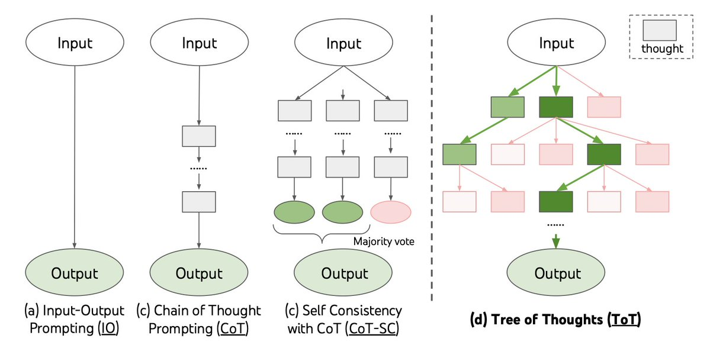

# Tree of Thoughts 🌳🌲🌴🌿🍃



[Paper link](https://arxiv.org/pdf/2305.10601.pdf)

Tree of Thoughts (ToT) is an all-new powerful and flexible algorithm that advances model reasoning by a whopping 70%. This is an plug in and play verision, connect your own models and enjoy superintelligence!

Share this repository by clicking on the following buttons 😊

[](https://twitter.com/intent/tweet?text=Check%20out%20this%20amazing%20project%20on%20improving%20AI%20reasoning%20-%20Tree%20of%20Thoughts!%20https://github.com/kyegomez/tree-of-thoughts)
[](https://www.linkedin.com/sharing/share-offsite/?url=https%3A%2F%2Fgithub.com%2Fkyegomez%2Ftree-of-thoughts)

# Join Agora, Creators United

This implementation of Tree of Thoughts is brought to you by Agora, Agora advances Humanity with open source SOTA Multi-Modality AI research! We plan on combating Humanity's grandest root problems like food insecurity, planetary insecurity, and disease, and hopefully death itself.

[Join our Discord and contribute to this project](https://discord.gg/qUtxnK2NMf)

## Getting started

Clone this repository with `git clone https://github.com/kyegomez/tree-of-thoughts`

or:

`pip install tree-of-thoughts `

Navigate to the repository folder: ` cd tree-of-thoughts`

`pip install openai`

Create a Python script (e.g., example.py) and import the necessary classes:

```python
from tree_of_thoughts.treeofthoughts import OpenAILanguageModel, CustomLanguageModel, TreeofThoughts, OptimizedOpenAILanguageModel, OptimizedTreeofThoughts

use_v2 = False
api_key=""
api_base= "" # leave it blank if you simply use default openai api url

if not use_v2:
    #v1
    model = OpenAILanguageModel(api_key=api_key, api_base=api_base # api_model="gpt4" # for higher performance base model is not smart
    )
else:
    #v2 parallel execution, caching, adaptive temperature
    model = OptimizedOpenAILanguageModel(api_key=api_key, api_base=api_base, # api_model="gpt4" # for higher performance base model is not smart
    )

#choose search algorithm('BFS' or 'DFS')
search_algorithm = "BFS"

#cot or propose
strategy="cot"

# value or vote
evaluation_strategy = "value"

if not use_v2:
    #create an instance of the tree of thoughts class v1
    tree_of_thoughts = TreeofThoughts(model, search_algorithm)
else:
    #or v2 -> dynamic beam width -< adjust the beam width [b] dynamically based on the search depth quality of the generated thoughts
    tree_of_thoughts= OptimizedTreeofThoughts(model, search_algorithm)

input_problem = "use 4 numbers and basic arithmetic operations (+-*/) to obtain 24"

k = 5
T = 3
b = 5
vth = 0.5
timeout = 10
confidence = 1.0 #cmodel is confident on performance
max_iterations = 40 #tree branch nodes
convergence_threshold = 0.01
convergence_count = 5


solution = tree_of_thoughts.solve(input_problem, k, T, b, vth, timeout, confidence_threshold=confidence, max_iterations=max_iterations, convergence_threshold=convergence_threshold, convergence_count=convergence_count)


#use the solution in your production environment
print(f'solution {solution}')


```

Or Integrate your own custom language model:

```python

class CustomLanguageModel(AbstractLanguageModel):
    def __init__(self, model):
        self.model = model

    def generate_thoughts(self, state, k):
        #implement the thought generation logic using self.model
        pass

    def evaluate_states(self, states):
        #implement state evaluation logic using self.model
        pass

```

Run the example script

## 🌟 Features:

- General problem-solving framework for language models
- Supports both breadth-first search (BFS) and depth-first search (DFS) algorithms
- Easy integration with popular language models like OpenAI and Hugging Face
- Extensible and adaptable to different problem properties and resource constraints

## Algorithmic Pseudocode

1. Define the thought decomposition based on the problem properties.
2. Create a thought generator function G(pθ, s, k) with two strategies:
   a. Sample i.i.d. thoughts from a CoT prompt.
   b. Propose thoughts sequentially using a "propose prompt".
3. Create a state evaluator function V(pθ, S) with two strategies:
   a. Value each state independently.
   b. Vote across states.
4. Choose a search algorithm (BFS or DFS) based on the tree structure.
5. Implement the chosen search algorithm.
6. Execute the chosen search algorithm with the input problem, thought generator, state evaluator, and other required parameters.

## Tree of Thoughts Class

```python
class TreeofThoughts:

    def __init__(self, model, search_algorithm):
        self.model = model
        self.search_algorithm = search_algorithm

    def solve(self, x, k, T, b, vth):
        if self.search_algorithm == 'BFS':
            return self.tot_bfs(x, k, T, b)
        elif self.search_algorithm == 'DFS':
            return self.tot_dfs(x, k, T, vth)
        else:
            raise ValueError("Invalid search algorithm. Choose 'BFS' or 'DFS'.")

    def tot_bfs(self, x, k, T, b):
        S0 = {x}
        for t in range(1, T + 1):
            S0_t = {(*s, z) for s in S0 for z in self.model.generate_thoughts(s, k)}
            Vt = self.model.evaluate_states(S0_t)
            St = sorted(S0_t, key=lambda s: Vt[s], reverse=True)[:b]
            S0 = set(St)
        return self.model.generate_thoughts(max(St, key=lambda s: Vt[s]), 1)

    def tot_dfs(self, x, k, T, vth):
        output = []

        def dfs(s, t):
            if t > T:
                output.append(self.model.generate_thoughts(s, 1))
                return
            for s_prime in sorted(self.model.generate_thoughts(s, k)):
                if self.model.evaluate_states({s_prime})[s_prime] > vth:
                    dfs((*s, s_prime), t + 1)

        dfs(x, 1)
        return output

```

## Usage Examples

### OpenAI API

To use Tree of Thoughts with OpenAI's API, create a custom model class that inherits from `AbstractLanguageModel` and implements the required methods using OpenAI's API. Then, create an instance of the `TreeOfThoughts` class with the custom model and the desired search algorithm ('BFS' or 'DFS').

### Hugging Face Transformers

To use Tree of Thoughts with Hugging Face Transformers, create a custom model class that inherits from `AbstractLanguageModel` and implements the required methods using Hugging Face Transformers. Then, create an instance of the `TreeOfThoughts` class with the custom model and the desired search algorithm ('BFS' or 'DFS').

# Contributing

This algorithm is still infant yet it's potential remains unimaginable, let's advance the reasoning of AI's together under this banner.

# Share With Your Network

You can easily share this repository by clicking on the following buttons:

[](https://twitter.com/intent/tweet?text=Check%20out%20this%20amazing%20project%20on%20improving%20AI%20reasoning%20-%20Tree%20of%20Thoughts!%20https://github.com/kyegomez/tree-of-thoughts)
[](https://www.linkedin.com/sharing/share-offsite/?url=https%3A%2F%2Fgithub.com%2Fkyegomez%2Ftree-of-thoughts)

For Instagram, while it doesn't directly support sharing of web links, you can share the screenshot of our project and the link in your caption or bio. You can download the project screenshot by clicking the image below:

[](https://github.com/kyegomez/tree-of-thoughts/raw/main/tree-of-thoughts.jpeg)

We greatly appreciate any help in spreading the word about our project. Thank you for your support!

## Roadmap

now:
Generate suite of evaluations used in the paper testing AI agents with other reasoning methods like COT and self consistency and run them in parallel to conduct evaluation experiments.

Implement a more sophisticated prompt engineering strategy to guide the model's reasoning process more effectively.

Make TreeofThoughts class completely customizable with a config yml file with params like
chatbot:
type: "openai"
max_context_length: 8000
include_chat_history_in_query: false
openai:
model: <model_name>
api_key: <your_open_ai_api_key>

Script that generates an dataset based on a topic input, -> set of questions are asked, then multiple trees of thoughts are run concurrently to generate the decision making rich dataset

Introduce a reinforcement learning, distillment, and finetuning scripts to finely tune the model based on feedback from the Tree of Thoughts algorithm.

Integrate heuristics that autonomously determine the search algorithm based on indicators

Integrate heuristics that autonomously determine the strategy cos or propose

Integrate heuristics that autonomously set the input params:

k =
T =
b =
vth =

multi-modality tree of thoughts

multi-modality forest of thoughts

multi-modality world of thoughts

### Multi-Modality Tree of Thoughts 🌐🌳

The next big advancement for the Tree of Thoughts algorithm is to extend it to multi-modality, enabling it to handle not only text but also images, audio, and other data types. This will bring us closer to multi-modal superintelligence.

#### Actionable Steps

1. Research and identify suitable multi-modal pre-trained models that can handle various data types (e.g., text, images, audio).
2. Adapt the thought decomposition, thought generator, and state evaluator functions to handle multi-modal data.
3. Develop a method for combining different modalities in the search tree, allowing the algorithm to reason across different data types.
4. Implement and test the multi-modal Tree of Thoughts algorithm with various problems and datasets.
5. Optimize the algorithm for performance and resource usage, ensuring it scales well with large multi-modal datasets.
6. Publish the results and gather feedback from the community to further improve the multi-modal Tree of Thoughts algorithm.

Join us on this exciting journey to advance the Tree of Thoughts algorithm to multi-modality superintelligence! 🚀

# The Compiler

[Utilizing Tree of Thoughts for optimal program synthesis](https://github.com/kyegomez/the-compiler)


Welcome to _The Compiler_, a novel child project under the Tree of Thoughts (ToT) paradigm. This project is crafted with the intent of making autonomous programming not just a reality, but an effortless task for you.

In essence, _The Compiler_ allows you to "grow" any program you can dream of. By providing a high-level specification of the product you would like, you can sit back and let _The Compiler_ do the heavy lifting.

## Overview

_The Compiler_ leverages the ToT framework and large language models (LLMs) to handle the programming process, from abstract specifications to a working program.

Here's a basic breakdown of the workflow:

1. **Input**: You provide an abstract specification for the product you would like.
2. **Unit Tests Generation**: We use an LLM on ToT to produce a suite of unit tests for the code.
3. **Run ToT**: We run the Tree of Thoughts LLM on the given specification, using the generated unit tests as the evaluation score.
4. **Output**: Ready to use program!

## Architecture

The Compiler, leveraging the Tree of Thoughts paradigm, consists of several primary components, including the Specification Parser, Thought Decomposer, Thought Generator, State Evaluator, and the Search Algorithm.

1. **Specification Parser**: This interprets your high-level input specifications and translates them into a format that the Thought Decomposer can understand and work with.

2. **Thought Decomposer**: This component breaks down the programming problem into manageable "thoughts" or steps.

3. **Thought Generator**: It generates potential thoughts or steps from the current state using two strategies, either sampling thoughts independently or proposing thoughts sequentially.

4. **State Evaluator**: It evaluates the progress of different states towards solving the programming problem, acting as a heuristic for the Search Algorithm.

5. **Search Algorithm**: This module determines which states to keep exploring and in which order. It employs either Breadth-First Search (BFS) or Depth-First Search (DFS), depending on the nature of the problem.

## Share The Compiler

If you find this project exciting and think others might benefit from it, feel free to share it. Use the buttons below to share it on various social media platforms:

- [Share on Twitter](http://twitter.com/share?text=Check%20out%20The%20Compiler%20project%20on%20GitHub!%20It%20allows%20you%20to%20autonomously%20create%20programs%20using%20abstract%20specifications.&url=https://github.com/kyegomez/the-compiler)
- [Share on LinkedIn](http://www.linkedin.com/shareArticle?mini=true&url=https://github.com/kyegomez/the-compiler&title=The%20Compiler%20Project&summary=This%20project%20is%20a%20revolution%20in%20autonomous%20programming!%20Check%20it%20out%20on%20GitHub.)
- [Share on Facebook](http://www.facebook.com/sharer.php?u=https://github.com/kyegomez/the-compiler)

Let's revolutionize the world of programming together with _The Compiler_!

# Acknowledgements

Thanks to: Shunyu Yao Princeton University, Dian Yu Google DeepMind, Jeffrey Zhao, Google DeepMind, Izhak Shafran Google DeepMind, Thomas L. Griffiths, Princeton University, Yuan Cao Google DeepMind, Karthik Narasimha, Princeton University for sharing this amazing work with the world!

And, thanks to Phil Wang or Lucidrains for inspiring me to devote myself to open source AI Research
