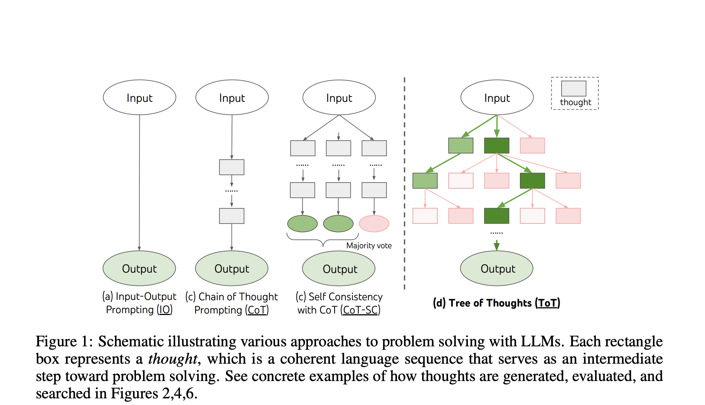

[](https://github.com/kyegomez/swarms)
[](https://arxiv.org/abs/2305.10601)
[](https://pypi.org/project/swarms/)
[](https://www.python.org/)
[](LICENSE)
[](https://docs.swarms.world)
[](https://discord.gg/EamjgSaEQf)

# Tree of Thoughts

**[Paper](https://arxiv.org/abs/2305.10601)** · **[Authors' implementation](https://github.com/princeton-nlp/tree-of-thought-llm)** · **[Swarms](https://github.com/kyegomez/swarms)**

Tree of Thoughts (ToT) makes a language model reason by search instead of in a single pass. The model proposes several candidate next steps, scores each one, prunes the weak branches, and backtracks when a line of reasoning fails. In the paper, GPT-4 with chain-of-thought prompting solved 4% of Game of 24 puzzles; with Tree of Thoughts it solved 74%.

> [!NOTE]
> Tree of Thoughts now ships as part of the [Swarms](https://github.com/kyegomez/swarms) framework as `TreeOfThoughts`. The examples and docs below use that implementation.


## How It Works

`TreeOfThoughts` grows a tree of partial solutions:

1. **Generate:** from a node, propose `num_thoughts` candidate next steps, either all in one call (`"propose"`) or one call per step (`"sample"`).
2. **Evaluate:** score each candidate from 0 to 1, either on its own (`"value"`) or by comparing candidates and voting (`"vote"`).
3. **Search:** explore breadth-first with a beam (`"bfs"`) or depth-first with backtracking (`"dfs"`), pruning candidates that score below `value_threshold`.
4. **Answer:** write the final answer from the best path found.

Every model output is a function call validated against a Pydantic schema, so the search never parses free-form prose. Calls at the same level of the tree run concurrently.

## Install

```bash
pip3 install -U swarms
```

Add your API key to a `.env` file in your working directory. Swarms loads it on import.

```bash
OPENAI_API_KEY="your_openai_api_key"
WORKSPACE_DIR="agent_workspace"
```

`model_name` accepts any [LiteLLM](https://docs.litellm.ai/docs/providers) model that supports function calling, so you can set `ANTHROPIC_API_KEY`, `GROQ_API_KEY` or another provider's key instead.

## Quickstart

```python
from swarms import TreeOfThoughts

agent = TreeOfThoughts(
    model_name="gpt-5.4",
    search_algorithm="dfs",
    max_depth=3,
    thought_description="One arithmetic operation on two of the remaining numbers.",
    evaluation_criteria="Can the remaining numbers still reach 24?",
)

answer = agent.run("Use 4, 9, 10 and 13 with + - * / to make 24.")
print(answer)
```

`run(task)` returns the answer. The full search is kept on `agent.last_result`:

```python
result = agent.last_result

for number, step in enumerate(result.steps, 1):  # the best reasoning path
    print(f"{number}. {step}")

print(result.solved)                  # True if a final step cleared value_threshold
print(result.nodes_expanded)          # nodes that had candidates generated
print(result.llm_calls)               # model calls, including the final answer
print(result.usage["total_tokens"])   # token usage for this search
tree = result.to_dict()               # the whole tree as JSON-serializable data
```

## Configuration

| Parameter | Default | Description |
|---|---|---|
| `model_name` | `"gpt-5.4"` | Any LiteLLM model string. The model must support function calling. |
| `search_algorithm` | `"bfs"` | `"bfs"` keeps the best `breadth` nodes per level. `"dfs"` follows the best child first and backtracks. |
| `generation_strategy` | `"propose"` | `"propose"` asks for all candidates in one call. `"sample"` makes one independent call per candidate. |
| `evaluation_strategy` | `"value"` | `"value"` rates each candidate on its own. `"vote"` compares candidates and scores them by votes. |
| `num_thoughts` | `3` | Candidate steps generated per expanded node. |
| `breadth` | `2` | BFS beam width. Ignored by DFS. |
| `max_depth` | `3` | Maximum steps on a path. Steps at this depth must complete the task. |
| `n_evaluate_samples` | `1` | Evaluator calls per candidate (value) or per comparison (vote). More samples give steadier scores. |
| `value_threshold` | `0.5` | Candidates scoring below this are pruned. |
| `max_expansions` | `None` | Cap on nodes expanded per search, to bound cost. |
| `thought_description` | `None` | What one step looks like for your task. Shown to the generator. |
| `evaluation_criteria` | `None` | How to judge progress for your task. Shown to the evaluator. |
| `system_prompt` | built-in | Replace it to give every call a domain persona. |
| `temperature` | `None` | Sampling temperature. `None` uses the provider's default. |
| `max_workers` | `8` | Maximum concurrent model calls. |
| `output_type` | `"final"` | How `run` formats its output. `"final"` returns the answer string. |
| `verbose` | `False` | Log every evaluated candidate. |
| `agent_kwargs` | `None` | Extra `Agent` arguments for every call, such as `max_tokens`, `llm_api_key` or `llm_base_url`. |

### Choosing settings

| Setting | Use | When |
|---|---|---|
| `search_algorithm` | `"bfs"` | Several partial solutions are worth keeping at once (scheduling, multi-step calculations). |
| | `"dfs"` | Case analysis and planning, where you commit to a line and backtrack on a contradiction. |
| `generation_strategy` | `"propose"` | Constrained steps, where one call can list distinct options. |
| | `"sample"` | Open-ended steps, where independent calls give more variety. |
| `evaluation_strategy` | `"value"` | Steps can be checked on their own (arithmetic, logic, units). |
| | `"vote"` | Quality is relative, so comparing candidates beats rating them (estimation, writing). |

`thought_description` and `evaluation_criteria` adapt the search to a domain more than any other setting. Cost grows with `num_thoughts`, `breadth`, `max_depth` and `n_evaluate_samples`; use `max_expansions` to cap it.

## Examples

Each example states its expected answer in its docstring, and each uses a different combination of settings.

### Game of 24

| Example | Search | Expected answer |
|---|---|---|
| [bfs.py](examples/bfs.py) | BFS, beam of 3 | (10 - 4) * (13 - 9) = 24 |
| [dfs.py](examples/dfs.py) | DFS with backtracking, `max_expansions` cap | (10 - 4) * (13 - 9) = 24 |

### Physics

| Example | Problem | Search | Expected answer |
|---|---|---|---|
| [relativistic_threshold.py](examples/physics/relativistic_threshold.py) | Threshold energy for antiproton production | DFS, `value_threshold=0.6` | 6 m_p c² ≈ 5.63 GeV |
| [hohmann_transfer.py](examples/physics/hohmann_transfer.py) | Hohmann transfer from a 300 km orbit to GEO | BFS, beam of 3, 2 ratings averaged per candidate | Δv ≈ 3.90 km/s, ≈ 5.27 h |
| [particle_in_a_box.py](examples/physics/particle_in_a_box.py) | Photon from an n = 3 → 1 transition in a 1 nm well | BFS, `generation_strategy="sample"` | ≈ 412 nm |

### Reasoning

| Example | Problem | Search | Expected answer |
|---|---|---|---|
| [logic_grid.py](examples/reasoning/logic_grid.py) | Match four researchers to floors, fields and drinks | BFS, beam of 3 | Unique assignment, given in the docstring |
| [missionaries_and_cannibals.py](examples/reasoning/missionaries_and_cannibals.py) | Get everyone across the river safely | DFS, one round trip per step, `max_expansions=20` | 11 crossings |
| [cheryls_birthday.py](examples/reasoning/cheryls_birthday.py) | Deduce a date from what others know | BFS, `evaluation_strategy="vote"`, 3 votes | July 16 |

### Frontier math

| Example | Problem | Search | Expected answer |
|---|---|---|---|
| [domino_tilings.py](examples/frontier_math/domino_tilings.py) | Count domino tilings of the 8 × 8 board | BFS, `sample`, 2 ratings averaged per candidate | 12,988,816 |
| [mordell_curve.py](examples/frontier_math/mordell_curve.py) | All integer solutions of y² = x³ − 2, with proof | DFS, `value_threshold=0.7`, custom `system_prompt` | (3, ±5) |
| [putnam_integral.py](examples/frontier_math/putnam_integral.py) | ∫₀¹ ln(1 + x) / (1 + x²) dx (Putnam 2005 A5) | BFS, beam of 2 | (π / 8) ln 2 ≈ 0.2722 |

```bash
python examples/physics/hohmann_transfer.py
```

More examples in mathematics, physics and logic, each with a checkable answer, are in the [Swarms Tree of Thoughts examples](https://github.com/kyegomez/swarms/tree/master/examples/reasoning_agents/tree_of_thoughts_examples).

## Prompts

You can also get Tree of Thoughts-style reasoning from a single prompt, with no code. Paste one of these into any chat model and put your question at the end.

### 1. Step-by-step experts

```txt
Imagine three different experts are answering this question. All experts will
write down 1 step of their thinking, then share it with the group. Then all
experts will go on to the next step, etc. If any expert realises they're wrong
at any point then they leave. The question is...
```

### 2. Collaborative experts

```txt
Simulate three brilliant, logical experts collaboratively answering a question.
Each one verbosely explains their thought process in real-time, considering the
prior explanations of others and openly acknowledging mistakes. At each step,
whenever possible, each expert refines and builds upon the thoughts of others,
acknowledging their contributions. They continue until there is a definitive
answer to the question. For clarity, your entire response should be in a
markdown table. The question is...
```

### 3. Tree of thoughts experts

```txt
Imagine three highly intelligent experts working together to answer a question.
They will follow a tree of thoughts approach, where each expert shares their
thought process step by step. They will consider the input from others, refine
their thoughts, and build upon the group's collective knowledge. If an expert
realizes their thought is incorrect, they will acknowledge it and withdraw from
the discussion. Continue this process until a definitive answer is reached.
Present the entire response in a markdown table. The question is...
```

### 4. Iterative refinement

```txt
Three experts with exceptional logical thinking skills are collaboratively
answering a question using a tree of thoughts method. Each expert will share
their thought process in detail, taking into account the previous thoughts of
others and admitting any errors. They will iteratively refine and expand upon
each other's ideas, giving credit where it's due. The process continues until
a conclusive answer is found. Organize the entire response in a markdown table
format. The question is...
```

## Roadmap

- [x] Breadth-first search with a beam
- [x] Depth-first search with backtracking and pruning
- [x] Value and vote evaluation
- [ ] Monte Carlo tree search
- [ ] Visualize a search tree from `result.to_dict()`

## Acknowledgements

Thanks to the authors of the paper for sharing this work with the world:

- Shunyu Yao, Princeton University
- Dian Yu, Google DeepMind
- Jeffrey Zhao, Google DeepMind
- Izhak Shafran, Google DeepMind
- Thomas L. Griffiths, Princeton University
- Yuan Cao, Google DeepMind
- Karthik Narasimhan, Princeton University

And thanks to Phil Wang ([lucidrains](https://github.com/lucidrains)) for inspiring me to devote myself to open source AI research.

## Citation

```bibtex
@misc{yao2023tree,
    title         = {Tree of Thoughts: Deliberate Problem Solving with Large Language Models},
    author        = {Shunyu Yao and Dian Yu and Jeffrey Zhao and Izhak Shafran and Thomas L. Griffiths and Yuan Cao and Karthik Narasimhan},
    year          = {2023},
    eprint        = {2305.10601},
    archivePrefix = {arXiv},
    primaryClass  = {cs.CL}
}
```

## License

[Apache 2.0](LICENSE)
